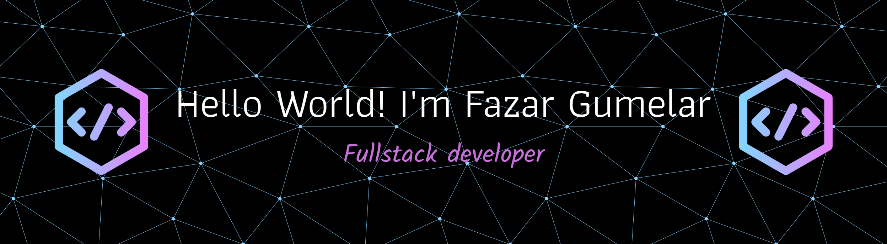

 

I’m a student who loves exploring the world of <b><i>technology</i></b> 💡 and <b><i>web development</i></b> 🌐.  
Passionate about learning new things 🌱, sharpening my coding skills 💻, and discovering the endless possibilities of <b><i>open-source</i></b> 🚀.  

###

  
  

###

  
  
  
  
  
  
  
  
  
  
  

###

 

###

  
  
  
  
  

###

 

<picture>
  <source media="(prefers-color-scheme: dark)" srcset="https://raw.githubusercontent.com/fazarprgmr/fazarprgmr/output/pacman-contribution-graph-dark.svg">
  <source media="(prefers-color-scheme: light)" srcset="https://raw.githubusercontent.com/fazarprgmr/fazarprgmr/output/pacman-contribution-graph.svg">
  
</picture>

###

 

###

  

###

 

  

###